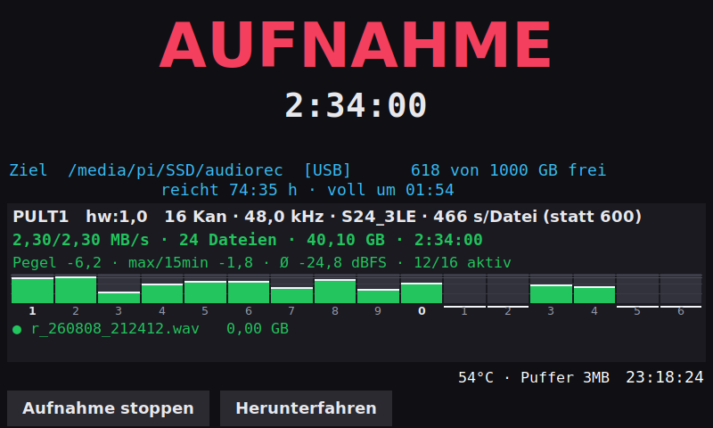
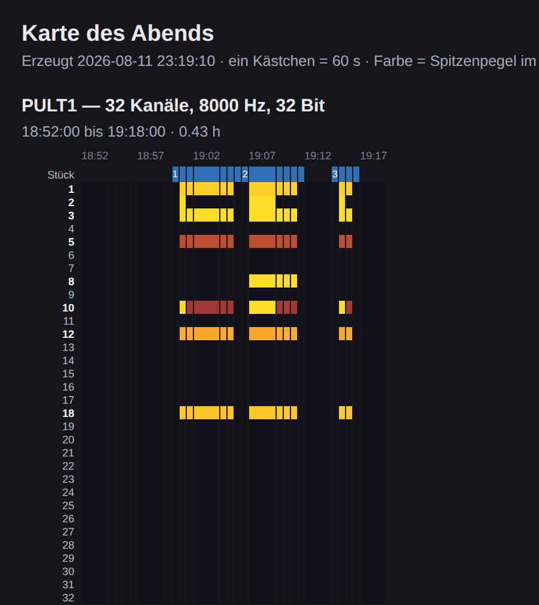
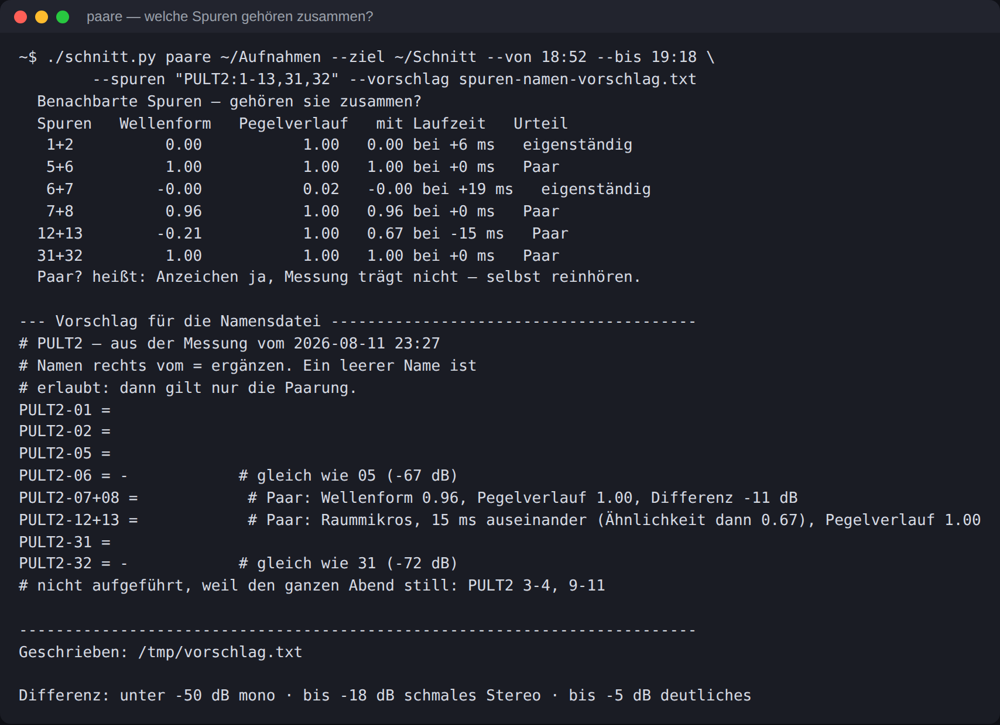

# AudioRecorder

Mehrspur-Mitschnitte aufnehmen und in Einzelspuren je Stück zerlegen — mit
einem Raspberry Pi als Recorder und einem Kommandozeilenwerkzeug für die
Nachbearbeitung.

Gedacht für den Fall, dass ein Abend mitgeschnitten werden soll und hinterher
je Stück eine saubere Spurgarnitur in der DAW liegen muss: Konzert, Session,
Gottesdienst, Konferenz. Zwei Pulte gleichzeitig gehen genauso wie eines.

```
Pult ──USB──┐
            ├── Raspberry Pi ── SSD ──► schnitt.py ──► ein Ordner je Stück
Pult ──USB──┘     (Schritt 1)              (Schritt 2)     mit Einzelspuren
```

Beide Teile sind unabhängig voneinander benutzbar. Der Recorder schreibt
gewöhnliche Mehrkanal-WAVs; das Schnittwerkzeug kommt mit allem zurecht, was
fortlaufend nummerierte WAVs mit Uhrzeit im Dateinamen liefert.

---

## Schritt 1 — Aufnehmen

Ein Raspberry Pi 5 mit einem Dienst, der jedes angesteckte Audio-Interface von
selbst aufnimmt. Keine Bedienung nötig: Interface anstecken, die Aufnahme
läuft innerhalb weniger Sekunden — mit allen Kanälen, die das Gerät anbietet.

* Mehrere Interfaces **gleichzeitig**, jedes mit eigenem Prozess und Ordner.
  Fällt eines aus, laufen die anderen weiter.
* Ziel ist eine angesteckte SSD oder ein Stick, sonst die SD-Karte.
* Neue Datei alle paar Minuten — dabei wird die 2-GiB-Grenze von `arecord`
  berücksichtigt, die bei vielen Kanälen lange vor der eingestellten Zeit
  erreicht ist.
* Optionaler Touchscreen mit Pegelanzeige, Temperatur, freiem Platz und der
  Frage, ob es noch reicht.
* Wachhund: Wächst die Datei nicht mehr, obwohl der Prozess lebt, wird neu
  gestartet.



*Die Anzeige auf dem Touchscreen: Pegel je Kanal, Datenrate, freier Platz und
wie lange er noch reicht. Zwei Geräte gleichzeitig sehen
[so aus](docs/bilder/anzeige-zwei.png).*

```bash
git clone https://github.com/Bascht74/AudioRecorder
cd AudioRecorder/recorder
sudo ./install.sh
```

Danach läuft der Dienst und startet bei jedem Neustart mit. Einstellungen in
`/etc/audiorec/audiorec.conf`, ausführlich kommentiert.

**→ [Ausführliche Anleitung: docs/aufnahme.md](docs/aufnahme.md)**

---

## Schritt 2 — Schneiden

`schnitt.py` zerlegt die fortlaufenden Mehrkanal-WAVs in einzelne Dateien je
Stück: gleicher Anfang, gleiche Länge, ein Ordner je Stück, BWF-Zeitstempel auf
die echte Uhrzeit.

```bash
cd AudioRecorder/schnitt
./schnitt.py karte   ~/Aufnahmen --ziel ~/Schnitt
./schnitt.py stuecke ~/Aufnahmen --ziel ~/Schnitt --datei stuecke.txt
```

Was dabei gemessen statt geraten wird:

| Frage | Befehl |
|---|---|
| Wann wurde gespielt, welche Spuren waren belegt? | `karte` |
| Wie weit laufen die Uhren zweier Pulte auseinander? | `sync` |
| Welche Spuren tragen dasselbe Signal, welche sind Stereopaare? | `paare` |
| Ist eine Spur die Summe mehrerer anderer? | `summe` |
| Wurde übersteuert, und wie oft? | `anschlag` |

Der erste Befehl misst einmal alles durch und zeichnet ein Wärmebild des
Abends — eine Zeile je Spur, eine Spalte je Minute, Farbe gleich Pegel. Daraus
liest man ab, wann gespielt wurde und welche Spuren belegt waren:



Die Stückgrenzen darüber (blau) findet das Werkzeug selbst und schlägt sie als
Textdatei vor — Zeiten prüfen, Namen eintragen, fertig.



*`paare` misst, welche Spuren zusammengehören: Stereopaare, doppelt liegende
Signale, Raummikrofone mit Laufzeit dazwischen. Der Vorschlag am Ende lässt
sich direkt als Namensdatei verwenden.*

**→ [Ausführliche Anleitung: docs/nachbearbeitung.md](docs/nachbearbeitung.md)**

### Mit einem Pult

Nichts weiter zu beachten — `sync` entfällt, alles andere bleibt gleich.

### Mit zwei Pulten

Zwei Geräte haben zwei Quarze und laufen über einen langen Abend auseinander:
gemessene **+5,32 ppm** an einem echten Abend sind nach 4,5 Stunden schon
**86 ms**. `sync` misst das an mehreren Stellen und rechnet es beim Schneiden
heraus — samt der Wanderung durch die Erwärmung der Geräte.

Dafür muss dasselbe Signal in beiden Aufnahmen liegen. Der übliche Weg: die
Stereosumme des einen Pults auf zwei Eingänge des anderen legen.

---

## Voraussetzungen

**Recorder:** Raspberry Pi OS (Bookworm oder neuer, 64 Bit). Der Installer
zieht `alsa-utils`, `python3`, `python3-tk`, `ffmpeg` und ein paar Werkzeuge
nach.

**Schnitt:** Python 3, `ffmpeg`, `numpy`; `sox` nur für die Driftkorrektur bei
zwei Geräten. Läuft auf macOS und Linux.

```bash
brew install ffmpeg sox          # macOS
sudo apt install ffmpeg sox      # Debian/Ubuntu
pip3 install --user numpy
```

---

## Aufbau des Repositorys

```
recorder/           Dienst für den Raspberry Pi
  install.sh        Installation und Aktualisierung
  etc/              Konfiguration und systemd-Unit
  opt/audiorec/     Dienst, Statusanzeige, Hilfswerkzeuge
schnitt/
  schnitt.py        das Schnittwerkzeug
  versatz.py        Zeitversatz zweier fertiger Dateien nachmessen
  mach-testmaterial.py   erzeugt eine synthetische Aufnahme zum Ausprobieren
docs/               ausführliche Anleitungen
```

## Ausprobieren ohne Hardware

`mach-testmaterial.py` baut eine vollständige Aufnahme nach: zwei Geräte mit
unterschiedlichem Takt, Dateiwechsel wie bei `arecord`, belegte und stille
Spuren, ein Stereopaar mit Laufzeit, ein Zuspieler, der nur bei einem Stück
läuft. Die Sollwerte stehen in `soll.json`.

```bash
python3 schnitt/mach-testmaterial.py ~/demo
python3 schnitt/schnitt.py karte ~/demo --ziel ~/demo-schnitt
```

## Lizenz

MIT — siehe [LICENSE](LICENSE).
