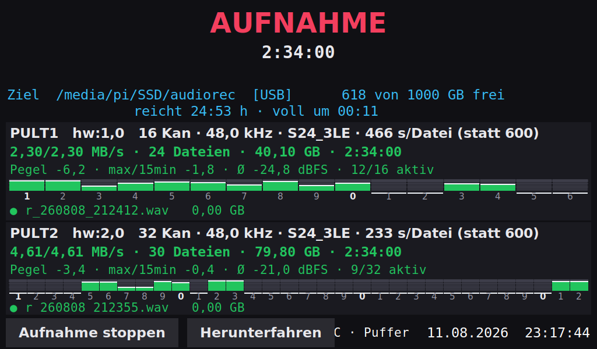

# Aufnahme: der Recorder auf dem Raspberry Pi

**Ein Gerät, keine Bedienung, jedes Interface wird von selbst aufgenommen**

Der Pi nimmt **jedes angesteckte Audio-Interface** auf — auch mehrere gleichzeitig, jedes als eigene Aufnahme mit eigenem Ordner und eigenem Prozess. Fällt eines aus, laufen die anderen weiter. Bedient wird nur über den Touchscreen, und auch das nur, wenn man will.

| Vorgang                     | Was passiert                                                    |
|-----------------------------|-----------------------------------------------------------------|
| Interface anstecken         | Aufnahme startet innerhalb von vier Sekunden, mit allen Kanälen |
| Zweites Interface anstecken | Zweite Aufnahme läuft parallel dazu                             |
| Interface abziehen          | Diese Aufnahme wird sauber geschlossen, die andere läuft weiter |
| Wieder anstecken            | Neue Session                                                    |
| USB-Stick anstecken         | Display fragt, ob er als Ziel dienen soll                       |
| Pi neu starten              | Alles kommt von allein hoch                                     |

------------------------------------------------------------------------

## 1. ⚠️ Zuerst: der Speicher

Das ist der Punkt, an dem eine Aufnahme scheitert.

| Quelle       | Kanäle | S32_LE                 | **S24_3LE**            |
|--------------|--------|------------------------|------------------------|
| Pult A       | 16     | 3,07 MB/s · 77 GB      | 2,30 MB/s · 58 GB      |
| Pult B       | 32     | 6,14 MB/s · 155 GB     | 4,61 MB/s · 116 GB     |
| **zusammen** | 48     | **9,22 MB/s · 232 GB** | **6,91 MB/s · 174 GB** |

*Werte für sieben Stunden.*

Eine 256-GB-Karte bietet nach Betriebssystem rund **232 GB** nutzbar. In 32 Bit wären das **100 % — es passt exakt nicht.**

### Die Lösung: 24 Bit statt 32

Die meisten Pulte wandeln mit **24 Bit**. `S32_LE` speichert dieselben 24 Nutzbits in vier statt drei Byte — ein Viertel mehr Daten, kein Deut mehr Klang.

In der Konfiguration steht deshalb jetzt:

``` ini
format_preference = S24_3LE, S32_LE, S16_LE
```

Damit sinkt der Bedarf auf **174 GB**, also 75 % der Karte. Das ist knapp, aber machbar. Bietet ein Gerät kein `S24_3LE`, fällt der Dienst für dieses Gerät automatisch auf `S32_LE` zurück.

**Prüfen, was tatsächlich ausgehandelt wurde:** Im Display steht je Gerät das Format. Steht dort bei beiden `S24_3LE`, stimmt die Rechnung.

### Besser: mehr Platz

| Träger             | 48 Kanäle, 24 Bit | Bewertung                    |
|--------------------|-------------------|------------------------------|
| 256 GB microSD     | 75 % belegt       | geht, wenig Reserve          |
| **512 GB microSD** | **37 % belegt**   | **empfohlen**                |
| USB-SSD als Ziel   | je nach Größe     | Display fragt beim Anstecken |

Für 20 bis 30 Euro Aufpreis bekommst du bei einer 512-GB-Karte die Sorge komplett vom Tisch. Bei einer Aufnahme, die sich nicht wiederholen lässt, ist das die günstigste Versicherung im ganzen Aufbau.

------------------------------------------------------------------------

## 2. Was installiert wird

| Datei                                  | Zweck                                                   |
|----------------------------------------|---------------------------------------------------------|
| `install-packages.sh`                  | Debian-Pakete installieren und auf Funktion prüfen      |
| `packages.txt`                         | Paketliste im Klartext                                  |
| `install.sh`                           | Programme, Dienst, Autostart, Touch-Rechte              |
| `/opt/audiorec/audiorec.py`            | Der Dienst                                              |
| `/opt/audiorec/status_display.py`      | Statusanzeige mit Touch-Bedienung                       |
| `/etc/audiorec/audiorec.conf`          | Konfiguration                                           |
| `/etc/systemd/system/audiorec.service` | startet beim Booten                                     |
| `/etc/sudoers.d/audiorec`              | erlaubt der Anzeige Herunterfahren und Dienst-Steuerung |

Kommunikation über `/run/audiorec/status.json` — der Dienst schreibt, die Anzeige liest. Antworten der Anzeige gehen über `/run/audiorec/input/answer.json` zurück. Bewusst simpel: kein Socket, kein D-Bus.

## 3. Vollautomatik ist die Voreinstellung

``` ini
[device]
match =                 # jedes angeschlossene Interface
max_devices = 0         # unbegrenzt viele gleichzeitig

[recording]
channels = auto         # so viele Kanäle, wie das Gerät hergibt
```

**`match =` leer** nimmt jede aufnahmefähige Soundkarte, die nicht in `ignore` steht (HDMI und Onboard-Ton sind dort bereits ausgeschlossen). Kein Gerätename zu pflegen.

**`channels = auto`** fragt das Gerät ab: ein Pult auf 16in/16out ergibt 16 Spuren, ein größeres 32, ein kleines Interface 4. Schlägt die Abfrage fehl, probiert der Dienst absteigend 32, 24, 16, 8, 4, 2 durch.

**`max_devices = 0`** heißt unbegrenzt. Jedes gefundene Interface bekommt einen eigenen Ordner `gig_<Gerät>_<Datum>_<Zeit>` und einen eigenen Prozess.

## 4. Dateinamen

    /home/pi/rec/gig_PULT1_2026-08-06_180012/r_260806_180012.wav
                                           r_260806_181012.wav
                 gig_PULT2_2026-08-06_180014/r_260806_180014.wav

Ordner trägt Gerät und Startzeit, Datei trägt Datum und Uhrzeit — jede Datei ist damit auch außerhalb ihres Ordners eindeutig.

### Die 4-GiB-Regel

WAV kann maximal 4 GiB pro Datei.

| Kanäle | Format  | Datenrate | 4 GiB nach | Datei nach 600 s |
|--------|---------|-----------|------------|------------------|
| 32     | S24_3LE | 4,61 MB/s | 15:31 min  | 2,77 GB          |
| 16     | S24_3LE | 2,30 MB/s | 31:03 min  | 1,38 GB          |
| 32     | S32_LE  | 6,14 MB/s | 11:39 min  | 3,69 GB          |

`max_file_time_s = 600` ist bei allen sicher — und begrenzt den Schaden bei einem Abriss auf zehn Minuten.

------------------------------------------------------------------------

## 5. Grundsystem

**Raspberry Pi OS (64-bit) mit Desktop**, mit dem **Raspberry Pi Imager** auf die Karte schreiben. Im Imager gleich mitgeben: Hostname (etwa `Aufnahme`), Benutzername und Passwort, WLAN, **SSH aktivieren**.

``` bash
sudo apt update && sudo apt full-upgrade -y
```

**Autologin in den Desktop** muss aktiv sein, sonst erscheint keine Statusanzeige — `raspi-config` → *System Options → Boot / Auto Login → Desktop Autologin*.

Der Dienst selbst braucht keinen Desktop; er nimmt auch dann auf, wenn die Anzeige nicht läuft.

## 6. Wohin aufgenommen wird

``` ini
target_dir = /home/pi/rec
require_mountpoint = no
min_free_gb = 20
```

Nach dem Imager wächst die Root-Partition auf die volle Kartengröße. Der Ordner wird vom Installationsskript angelegt.

**Warum die SD-Karte gut passt:** Ihr Slot hängt am Pi 5 an einer eigenen Schnittstelle, nicht am USB-Controller. Die Aufnahme teilt sich also keinen Bus mit den Pulten.

> **`min_free_gb` vor der Veranstaltung hochsetzen.** 20 steht beim Ausprobieren nicht im Weg; vor einer langen Aufnahme gehört dort der erwartete Bedarf plus rund 30 % hinein. Dann warnt der Dienst rechtzeitig statt mitten in der Nacht.

### USB-Stick oder SSD als Ziel

Wird ein Wechseldatenträger gefunden, fragt das Display:

> **USB-Stick gefunden: /media/pi/REC** Als Ziel für die Aufnahmen verwenden? ⚠ Dafür wird die laufende Aufnahme kurz gestoppt und auf dem Stick neu gestartet. **\[ Ja \] \[ Nein \]**

Der Warnhinweis erscheint nur, wenn tatsächlich etwas läuft. Bei **Nein** wird derselbe Träger nicht wieder gefragt, solange er steckt. Beim Abziehen fällt das Ziel auf die SD-Karte zurück.

Umschaltbar über `usb_target`: `ask` (Voreinstellung), `auto` oder `no`.

### Formatierung

| Verwendung                               | Format                                         |
|------------------------------------------|------------------------------------------------|
| Bleibt am Pi, Abholung per `rsync`       | **ext4** — journaled, robust                   |
| Soll abgezogen und am Mac gelesen werden | **exFAT** — kein Journal, dafür überall lesbar |

Nicht FAT32 (4-GiB-Grenze), nicht NTFS, nicht HFS+/APFS — **Linux kann Mac-Dateisysteme nicht beschreiben, macOS kein ext4.** exFAT ist der einzige gemeinsame Nenner, und der hat kein Journal. Journal oder plattformübergreifender Zugriff: beides zusammen gibt es nicht.

``` bash
sudo mkfs.ext4  -L REC /dev/sda1
sudo mkfs.exfat -n REC /dev/sda1
```

------------------------------------------------------------------------

## 7. Installation

``` bash
scp ~/Downloads/audiorec-pi5.tar.gz pi@192.168.100.55:~
ssh pi@192.168.100.55
mkdir -p ~/audiorec-pkg
tar xzf ~/audiorec-pi5.tar.gz -C ~/audiorec-pkg
cd ~/audiorec-pkg
chmod +x install-packages.sh install.sh
sudo ./install.sh
sudo reboot
```

Das Archiv hat keinen Oberordner — deshalb das eigene Verzeichnis. Vorhandene Konfiguration bleibt bei einer Neuinstallation erhalten, die neue landet als `audiorec.conf.neu` daneben.

Am Ende zeigt das Skript die Funktionsprüfung (`arecord`, `ffmpeg`, `tmux`, Tkinter), ob der Dienst läuft, und die geltende Konfiguration.

## 8. Bedienung über den Touchscreen

| Fläche               | Verhalten                                                 |
|----------------------|-----------------------------------------------------------|
| **Aufnahme stoppen** | Rückfrage „Wirklich stoppen?", zweite Berührung führt aus |
| **Aufnahme starten** | erscheint, wenn gestoppt — startet sofort                 |
| **Herunterfahren**   | Rückfrage, zweite Berührung fährt herunter                |
| **Ja / Nein**        | nur bei der USB-Rückfrage                                 |

Rückfragen verfallen nach fünf Sekunden von selbst. Ein Fehlgriff bleibt folgenlos.

**Herunterfahren immer über diese Fläche**, nicht über das Netzteil — ein hart abgeschalteter Pi kann die Karte beschädigen, und darauf liegt die Aufnahme.

## 9. Was das Display zeigt




Oben Zustand, Laufzeit und Meldung, darunter Ziel und Platz, dann **je Gerät ein Block**:

                  AUFNAHME
                   2:14:07
            2 Geräte nehmen auf

    Ziel  /home/pi/rec      158 von 232 GB frei      reicht 6:21 h

    ┌ PULT1 hw:1,0   16 Kan · 48,0 kHz · S24_3LE ──────────────┐
    │ 2,30 / 2,30 MB/s      13 Dateien · 18,4 GB      2:14:07  │
    │   r_260806_200012.wav   1,38 GB                          │
    │ ● r_260806_201012.wav   0,52 GB                          │
    └──────────────────────────────────────────────────────────┘
    ┌ PULT2 hw:2,0   32 Kan · 48,0 kHz · S24_3LE ──────────────┐
    │ 4,61 / 4,61 MB/s      13 Dateien · 36,9 GB      2:13:58  │
    │   r_260806_200014.wav   2,77 GB                          │
    │ ● r_260806_201014.wav   1,04 GB                          │
    └──────────────────────────────────────────────────────────┘

Die Blöcke entstehen dynamisch — ein Gerät, zwei, drei. Ab drei Geräten wird die Dateiliste je Block auf eine Zeile gekürzt.

| Zustand         | Farbe | Bedeutung                     |
|-----------------|-------|-------------------------------|
| **AUFNAHME**    | grün  | läuft                         |
| **WARTE**       | gelb  | kein Interface gefunden       |
| **STARTE**      | blau  | Gerät erkannt                 |
| **FEHLER**      | rot   | Details in der Zeile darunter |
| **GESTOPPT**    | grau  | über den Touch-Button beendet |
| **KEIN DIENST** | rot   | Dienst antwortet nicht        |

### Worauf du achtest

**Die Datenrate je Block, Ist gegen Soll.** Stimmen beide überein, fließt tatsächlich Audio. Fällt der Istwert unter 85 %, wird die Zeile rot — dann läuft zwar ein Prozess, aber es kommt nichts an.

**Die grün markierte Datei.** Ihre Größe wächst sichtbar von Sekunde zu Sekunde. Das ist der Lebendbeweis.

**Die Zeile „reicht".** Unter zwei Stunden Restlaufzeit wird sie rot, ebenso freier Platz unter 12 %.

## 10. Wie sich der Dienst verhält

- **Gerät erkannt** → eigener Ordner, Start mit maximaler Kanalzahl
- **Gerät verschwindet** → SIGINT an arecord, Header sauber geschlossen; andere Geräte laufen weiter
- **arecord stürzt ab** → Fehler im Block, **automatischer neuer Versuch nach 10 Sekunden**
- **Zu wenig Platz** → Fehler, es wird gar nicht erst gestartet; angeschlossene Geräte werden trotzdem angezeigt
- **Pi stürzt ab** → systemd startet den Dienst nach dem Booten automatisch

`Nice=-5` und Echtzeit-I/O-Priorität sorgen dafür, dass die Aufnahme unter Last nicht als Erstes leidet.

## 11. Material wegkopieren

ext4 ist am Mac nicht lesbar, also über Netzwerk vom laufenden Pi:

``` bash
rsync -av --progress pi@Aufnahme.local:/home/pi/rec/ ~/Aufnahmen/
```

`rsync` setzt abgebrochene Übertragungen fort — bei 174 GB über WLAN angenehm. Per Ethernet deutlich schneller. Löst `Aufnahme.local` nicht auf, die IP nehmen (`hostname -I` auf dem Pi).

Erst wenn zwei Kopien an verschiedenen Orten liegen, auf dem Pi löschen.

## 12. In Einzelspuren zerlegen

``` bash
for f in gig_PULT1_*/*.wav; do
  for i in $(seq 0 15); do
    ffmpeg -hide_banner -loglevel error -i "$f" -af "pan=mono|c0=c$i" \
           -c:a pcm_s24le "spur$(printf %02d $((i+1)))_$(basename "$f")"
  done
done
```

Obergrenze an die Kanalzahl anpassen — bei 16 Kanälen also 15, bei 32 dann 31. Die Zeitabschnitte hängst du in der DAW hintereinander; `arecord` schreibt lückenlos.

## 13. Prüfen und reparieren

Dauer und Größe aller Dateien:

``` bash
for f in /home/pi/rec/gig_*/*.wav; do
  echo "== $f"; ffprobe -v error -show_entries format=duration,size -of default=nw=1 "$f"
done
```

Liefert `ffprobe` eine Dauer, ist der Header sauber geschlossen. Wenn nicht — **Audacity** → `Datei` → `Importieren` → `Rohdaten`: Signed 24-bit PCM, Little-endian, passende Kanalzahl, 48000 Hz, Startversatz ca. 100 Byte.

## 14. Fehlersuche

**Display bleibt schwarz** — Autologin prüfen. Test über SSH: `DISPLAY=:0 python3 /opt/audiorec/status_display.py`. Bei Tkinter-Fehler: `sudo apt install python3-tk`.

**Status ohne Display lesen** — `python3 -m json.tool /run/audiorec/status.json`, laufend mit `watch -n1`.

**„WARTE", obwohl ein Pult an ist** — `cat /proc/asound/cards`: taucht es auf? Nein → Kabel, Port, Karteneinstellung am Pult.

**„Gerät nimmt keine der versuchten Kanalzahlen an"** — `arecord -D hw:1,0 --dump-hw-params -d 1` zeigt, was möglich ist.

**„Zu wenig Platz"** — `df -h /home/pi/rec`, alte Sessions löschen oder `min_free_gb` anpassen.

**Touch-Flächen reagieren nicht** — `sudo -l | grep shutdown`. Fehlt die Regel, `sudo ./install.sh` erneut ausführen.

**Datenrate zu niedrig** — meist Unterspannung: `vcgencmd get_throttled` (0x0 ist gut). Sonst größere Puffer: `arecord_extra = --buffer-time=500000 --period-time=100000`

**Protokoll** — `journalctl -u audiorec -f -o cat`. Das `-o cat` verhindert, dass Zeilen an der Fensterbreite abgeschnitten werden.

## 15. Verkabelung

- **Pulte an USB-2-Ports** (schwarz) — die USB-Karten der gängigen Pulte sind USB 2.0
- **Originalnetzteil 27 W.** Unterspannung ist die häufigste Ursache für Aussetzer
- Kein USB-Hub
- USB-3-Ports (blau) bleiben für eine SSD frei

Zwei Pulte mit zusammen 48 Kanälen belegen rund 74 Mbit/s — USB 2.0 trägt das, aber getrennte Ports sind besser als ein Hub.

------------------------------------------------------------------------

## 16. Probelauf

**Es ist nichts umzustellen** — `match` ist leer, `channels = auto`, also funktioniert jedes Interface sofort.

1.  **Ein Interface einstecken.** Innerhalb von vier Sekunden **AUFNAHME**
2.  **Block prüfen:** Kanäle, Format, Datenrate Ist ≈ Soll
3.  **Zusehen, wie die grüne Datei wächst**
4.  **Zweites Interface anstecken** → zweiter Block, beide laufen parallel
5.  **Eines abziehen** → nur dieser Block verschwindet, das andere läuft weiter
6.  **Datei prüfen** (Abschnitt 13) — Dauer muss stimmen
7.  **USB-Stick anstecken** → Rückfrage erscheint, einmal *Nein*, einmal *Ja* durchspielen
8.  **Touch-Flächen testen:** stoppen mit Rückfrage, wieder starten
9.  **Herunterfahren über den Button**, Strom aus und an — alles muss allein hochkommen
10. **Reinhören.** Eine Datei abspielen, nicht nur die Größe ansehen
11. **`rsync` vom Mac üben**

Für Schritt 3 kannst du `max_file_time_s` vorübergehend auf `60` setzen, dann siehst du den Dateiwechsel nach einer Minute. **Danach wieder auf 600.**

### Was der Probelauf nicht beantwortet

Ob **deine Geräte mit voller Kanalzahl über viele Stunden** stabil laufen. Dafür braucht es einen Durchlauf mit der echten Hardware — mindestens 30 bis 40 Minuten, besser eine Stunde.

------------------------------------------------------------------------

## Offene Punkte

**Dieses Paket ist nur teilweise an echter Hardware gelaufen.** Bestätigt sind: Geräteerkennung, Kanal-Aushandlung, Aufnahme, Dateisplitting, sauberes Schließen beim Abziehen, Statusdatei, Anzeige auf dem DSI-Display. Die Mehrgeräte-Verwaltung, die USB-Rückfrage und die Touch-Flächen sind geschrieben und isoliert getestet, aber noch nicht im Zusammenspiel erprobt.

Drei Punkte, an denen ich am ehesten mit Nacharbeit rechne:

1.  **Zwei Pulte gleichzeitig am USB-Bus.** Rechnerisch unkritisch, praktisch die interessanteste Frage des ganzen Aufbaus
2.  **Das Aushandeln von `S24_3LE`.** Bieten die Pulte es nicht an, greift `S32_LE` — und der Speicherbedarf steigt von 174 auf 232 GB. Auf dem Display siehst du je Gerät, was tatsächlich läuft
3.  **Die Bildschirmaufteilung bei zwei Blöcken.** Bei einem Gerät hat es gepasst; ob zwei Blöcke plus USB-Rückfrage gleichzeitig auf das Display passen, zeigt erst der Test. Stellschrauben sind die Faktoren `f_huge` bis `f_file` oben in `status_display.py`
