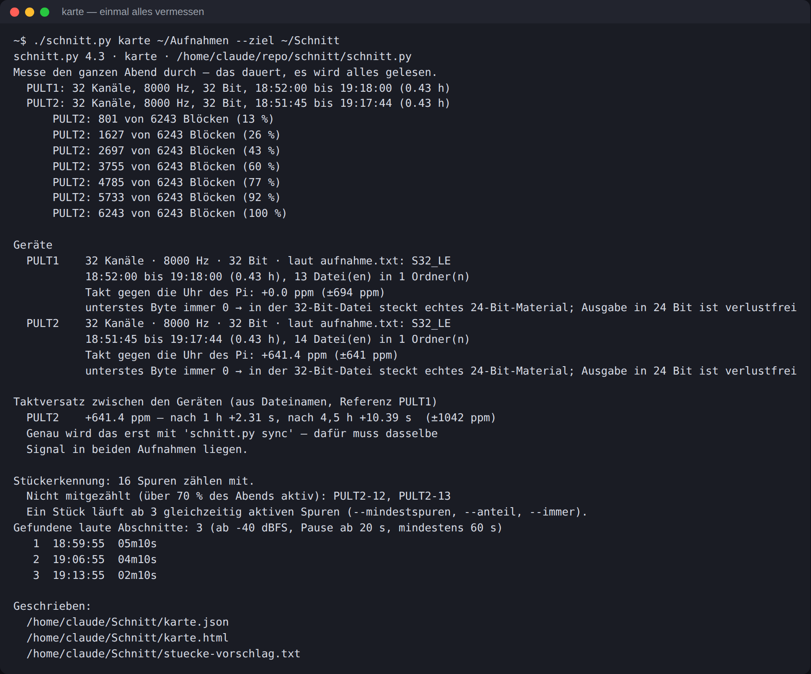
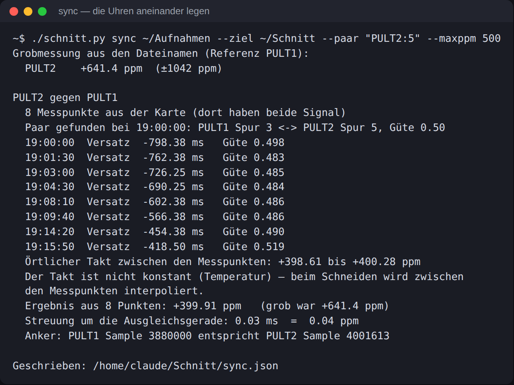
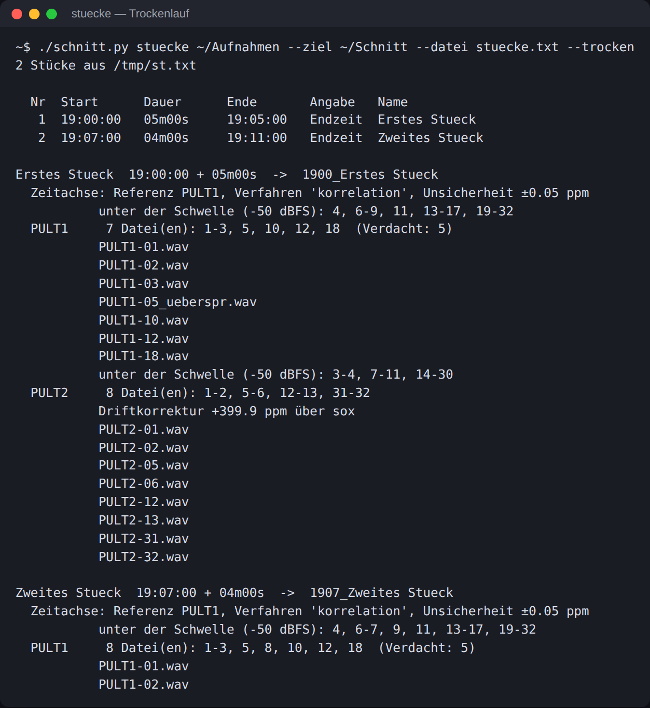
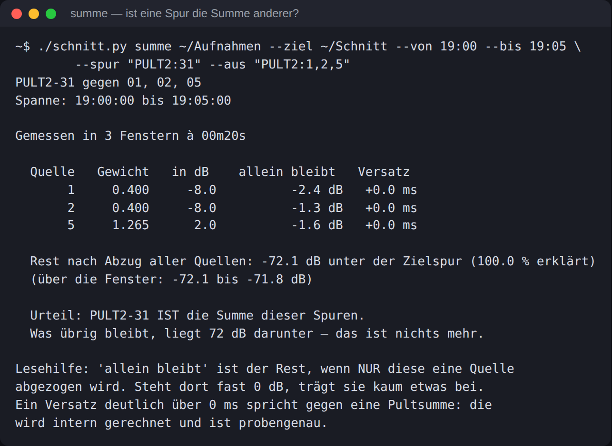

# Nachbearbeitung: `schnitt.py`

Zerlegt Mehrkanal-Mitschnitte in einzelne Spuren je Stück — Fassung 4.3

> **Der Ablauf.** Alles andere in diesem Text ist Erklärung dazu.
>
>     ./schnitt.py kuerzen ~/Aufnahmen --von 19:00 --bis 23:35
>     ./schnitt.py kuerzen ~/Aufnahmen --von 19:00 --bis 23:35 --loeschen
>     ./schnitt.py karte   ~/Aufnahmen --ziel ~/Schnitt
>     ./schnitt.py sync    ~/Aufnahmen --ziel ~/Schnitt --paar "PULT2:5"
>     ./schnitt.py paare   ~/Aufnahmen --ziel ~/Schnitt --von 19:00 --bis 23:25 \
>                  --vorschlag spuren-namen-vorschlag.txt
>     ./schnitt.py stuecke ~/Aufnahmen --ziel ~/Schnitt --datei stuecke.txt \
>                  --namen spuren-namen.txt --trocken
>     ./schnitt.py stuecke ~/Aufnahmen --ziel ~/Schnitt --datei stuecke.txt \
>                  --namen spuren-namen.txt
>
> Zeile 1 zeigt nur an, Zeile 2 räumt weg. Dazwischen: `stuecke-vorschlag.txt` gegen das Wärmebild prüfen und als `stuecke.txt` sichern, den Paar-Vorschlag in `spuren-namen.txt` übernehmen.

## 1. Was das Werkzeug tut

Auf der Platte liegen je Pult ein Ordner mit fortlaufenden Mehrkanal-WAVs (`r_260808_190000.wav` …). Daraus soll werden: **ein Ordner je Stück, darin je eine Mono-Datei pro belegter Spur** — alle mit demselben Anfang und derselben Länge, damit die DAW sie in einem Rutsch übereinanderlegt.

- **Zeitfenster** über Startuhrzeit und Dauer, auf **beide Pulte gleichzeitig** angewandt.
- **Belegte Spuren erkennt es selbst**, Fenster für Fenster. Leise Spuren, die nach Übersprechen aussehen, werden im Dateinamen markiert, nicht weggeworfen.
- **Der Taktversatz der beiden Pulte wird gemessen und herausgerechnet**, damit die Spuren über den ganzen Abend synchron bleiben.
- **BWF-Zeitstempel** in jeder Datei: Die DAW kann sie damit auf die echte Uhrzeit des Tages legen.
- Es wird **nichts zwischengespeichert** — jede Datei entsteht in einem Durchlauf direkt aus dem Original.

## 2. Voraussetzungen

    brew install ffmpeg sox
    pip3 install --user numpy

`ffmpeg` macht das Schneiden und Messen, `sox` die Taktkorrektur. `numpy` rechnet in `sync`, `paare` und `anschlag` — ohne numpy laufen diese drei nicht, alles andere schon; der Taktversatz wird dann nur grob aus den Dateinamen geschätzt.

    chmod +x schnitt.py
    ./schnitt.py --help

## 2a. Vorher aufräumen: alles außerhalb des Abends aussortieren

Wenn ab 15:00 aufgenommen wurde, das Event aber erst um 19:00 begann, liegen vier Stunden Material herum, die niemand braucht — bei zwei Pulten rund 180 GB. Die Dateien davor und danach dürfen weg. **Der Zeitablauf bleibt dabei heil:** jede Datei trägt ihre Uhrzeit im Namen, das Werkzeug rechnet für jede einzeln — es zählt nicht ab dem Anfang durch.

    ./schnitt.py kuerzen ~/Aufnahmen --von 19:00 --bis 23:35

Das ist erst einmal nur eine **Vorschau** und fasst nichts an:

    Behalten wird alles zwischen 2026-08-08 18:55:00 und 2026-08-08 23:40:00
    (gewünschtes Fenster 19:00:00 + 4h35m00s, dazu 05m00s Puffer auf jeder Seite)

    PULT1 — gig_PULT1_2026-08-08_150312
      vorhanden : 104 Dateien, 15:03:12 bis 23:38:55, 190.1 GB
      bleibt    :  56 Dateien, 18:53:12 bis 23:38:55, 103.4 GB
      weg       :  48 Dateien, 86.7 GB  (r_260808_150312.wav … r_260808_185012.wav)

    ./schnitt.py kuerzen ~/Aufnahmen --von 19:00 --bis 23:35 --verschieben
    ./schnitt.py kuerzen ~/Aufnahmen --von 19:00 --bis 23:35 --loeschen

`--verschieben` legt sie in einen Unterordner `_weg` — umkehrbar, **schafft aber keinen Platz**: die Dateien liegen weiterhin auf derselben Platte. Ist der Speicher knapp, hilft nur `--loeschen`, und das ist endgültig. `--puffer` steuert, wie viel zusätzlich stehen bleibt (Vorgabe 300 s auf jeder Seite).

> **Drei Dinge, auf die es dabei ankommt:**
>
> - **Die Datei, in der 19:00 Uhr liegt, muss bleiben.** Das ist nicht die erste mit einem Zeitstempel nach 19:00, sondern die letzte davor — sie enthält die erste Minute. `kuerzen` rechnet das selbst aus, an der Stelle vertut man sich beim Abzählen leicht.
> - **Niemals mittendrin löschen.** Vorne und hinten wegnehmen ist harmlos; ein Loch in der Mitte ist eine echte Lücke, und alles dahinter sitzt danach zu früh.
> - **Jedes Pult hat eigene Dateigrenzen.** Das Behringer hat um 19:00 nicht dieselbe Datei offen wie der Pult A. `kuerzen` geht deshalb je Ordner vor — von Hand müsstest du das für beide getrennt machen.
>
> `aufnahme.txt` und `spuren.txt` bleiben liegen, die kosten nichts und stehen für die Formatangaben.

> **Ein Preis ist damit verbunden:** Die *grobe* Taktmessung aus den Dateinamen wird ungenauer, weil sie über die Länge der Aufnahme mittelt. Über 8,5 Stunden sind das ±32 ppm, über die gekürzten 4,5 Stunden ±62 ppm. Das zählt nur, falls `sync` kein gemeinsames Signal findet — mit der Pultsumme auf PULT2 5/6 ist das nicht zu erwarten. Am nachgebauten Material lieferte `sync` vor und nach dem Kürzen dasselbe Ergebnis.

## 3. Schritt 1 — die Karte des Abends

    ./schnitt.py karte ~/Aufnahmen --ziel ~/Schnitt

Das liest **jede Probe jeder Spur einmal durch** — bei zwei Pulten über 4,5 Stunden sind das rund 200 GB, je nach Platte etwa 20 bis 90 Minuten. Danach ist es getan: alle weiteren Befehle greifen auf das Messergebnis zu und antworten in Sekundenbruchteilen.

Es entstehen drei Dateien:

| Datei                   | Inhalt                                                                                                                                                              |
|-------------------------|---------------------------------------------------------------------------------------------------------------------------------------------------------------------|
| `karte.json`            | Spitzen- und Effektivpegel jeder Spur im Viertelsekundenraster über den ganzen Abend. Das ist der Zwischenspeicher.                                                 |
| `karte.html`            | Wärmebild: eine Zeile je Spur, eine Spalte je Minute, Farbe = Pegel. **Hier siehst du auf einen Blick, wann welche Band spielte und welche Spuren sie belegt hat.** |
| `stuecke-vorschlag.txt` | Automatisch gefundene Stücke mit Startzeit und Dauer — die Vorlage für Schritt 3.                                                                                   |

> **Wird zwischendurch gekürzt, muss die Karte neu.** Sie legt die Blöcke nach Sample-Position ab, nicht nach Uhrzeit. Verschwinden Dateien (oder kommen welche dazu), zeigt jede Uhrzeit auf einen falschen Block — es kämen die Pegel einer *anderen Stelle des Abends* heraus, ohne dass man es merkt. Ab Fassung 4.2 vergleicht das Werkzeug beim Laden Dateizahl und Länge jedes Aufnahmeordners mit dem, was in der Karte steht, und misst bei Abweichung von selbst neu.

> **Die Messung läuft nur einmal.** Ruft man `karte` erneut auf und `karte.json` ist schon da, wird nicht neu gemessen — es wird nur die Auswertung neu gerechnet, in Sekunden. So kannst du die Stückerkennung nachstellen, ohne wieder 200 GB zu lesen:
>
>     ./schnitt.py karte . --ziel Schnitt --pause 60     # Stücke zusammenfassen
>     ./schnitt.py karte . --ziel Schnitt --anteil 0.5   # strenger
>     ./schnitt.py karte . --ziel Schnitt --frisch       # wirklich neu messen
>
> Zerfällt ein Stück in mehrere Abschnitte, sagt es das von selbst und nennt den passenden Befehl.

Auf der Kommandozeile stehen außerdem die Angaben, die du brauchst: Kanalzahl, Abtastrate, Format, Aufnahmedauer, der Taktversatz gegen die Uhr des Pi — und die Antwort auf die Frage, ob 24 Bit reichen:

    PULT1     32 Kanäle · 48000 Hz · 32 Bit · laut aufnahme.txt: S32_LE
             19:04:12 bis 23:38:55 (4.58 h), 55 Datei(en) in 1 Ordner(n)
             Takt gegen die Uhr des Pi: +12.3 ppm (±61 ppm)
             unterstes Byte immer 0 → in der 32-Bit-Datei steckt echtes
             24-Bit-Material; Ausgabe in 24 Bit ist verlustfrei

> **Wie die Stücke gefunden werden — und warum nicht am Pegel allein.** Die Publikumsmikrofone auf PULT2 12/13 sind den ganzen Abend über laut. Ein reiner Pegelvergleich hielte deshalb den kompletten Abend für ein einziges Stück. Das Werkzeug zählt stattdessen, **wie viele Spuren gleichzeitig arbeiten**: spielt eine Band, sind viele Spuren aktiv; in der Umbaupause nur die Raummikrofone. Stellschrauben: `--anteil` (Vorgabe 0,15 — so viele der mitzählenden Spuren müssen gleichzeitig arbeiten), `--pause` (20 s Ruhe trennen zwei Stücke), `--mindest` (kürzer als 60 s ist kein Stück), `--vorlauf` und `--nachlauf` (je 5 s Zugabe).

## 4. Schritt 2 — die beiden Uhren aneinander legen

    ./schnitt.py sync ~/Aufnahmen --ziel ~/Schnitt --paar "PULT2:5"

Jedes Pult wandelt mit seinem eigenen Quarz. Über einen langen Abend laufen zwei Aufnahmen deshalb auseinander — das ist keine Lücke, sondern der Unterschied der Taktquellen. Es gibt zwei Wege, ihn zu messen:

| Weg                                        | Grundlage                                                                                                                | Genauigkeit                                                                                                                                                                                       |
|--------------------------------------------|--------------------------------------------------------------------------------------------------------------------------|---------------------------------------------------------------------------------------------------------------------------------------------------------------------------------------------------|
| **Grob** — läuft immer                     | Uhrzeit im Dateinamen gegen aufsummierte Audiolänge                                                                      | ±60 ppm über einen 5-Stunden-Abend. Die Dateinamen haben nur Sekundenauflösung, das ist die Grenze. Auf ein 6-Minuten-Stück gerechnet: bis zu 22 ms Restversatz.                                  |
| **Genau** — braucht ein gemeinsames Signal | Kreuzkorrelation desselben Signals in beiden Aufnahmen, an vielen Stellen über den Abend verteilt, dann Ausgleichsgerade | Am Testmaterial mit bekanntem Versatz: **399,94 ppm gemessen bei 400 ppm Sollwert**, Streuung 0,04 ppm. An einem echten Abend mit zwei Pulten: **+5,32 ppm aus zwölf Punkten**, Streuung 2,61 ms = 0,17 ppm. |

> **Meist ist das gemeinsame Signal die Stereosumme des einen Pults, die auf zwei Eingängen des anderen liegt.** Mit `--paar "PULT2:5"` nagelst du die eine Seite fest: damit ist die eine Seite festgenagelt, die passende Spur des anderen Geräts sucht das Werkzeug selbst (sie muss in der Summe deutlich hörbar sein — Bass, Gesang, irgendetwas Durchgehendes).
>
> Lässt du `--paar` weg, probiert es alle lauten Spuren beider Pulte gegeneinander durch. Das dauert länger und kann danebengreifen.

Das Ergebnis landet in `sync.json` und wird von `schnitt` und `stuecke` automatisch benutzt. Ausgabe:

    Paar gefunden bei 19:02:02: PULT1 Spur 18 <-> PULT2 Spur 6, Güte 0.96
      19:02:02  Versatz   +91.75 ms   Güte 0.960
      …
      23:23:22  Versatz  +176.00 ms   Güte 0.928
      Örtlicher Takt zwischen den Messpunkten: +4.07 bis +7.38 ppm
      Der Takt ist nicht konstant (Temperatur) — beim Schneiden wird zwischen
      den Messpunkten interpoliert.
      Ergebnis aus 12 Punkten: +5.32 ppm   (grob war +0.0 ppm)
      Streuung um die Ausgleichsgerade: 2.61 ms  =  0.17 ppm

> **Der Takt ist nicht konstant.** Über den echten Abend wanderte er zwischen +4,07 und +7,38 ppm — die Pulte werden warm, der Quarz zieht mit. Eine einzelne Ausgleichsgerade ließe dadurch bis zu 8 ms stehen. Deshalb wird beim Schneiden **zwischen den Messpunkten interpoliert**: jedes Stück bekommt den Faktor, der zu seiner Uhrzeit gehört. In der Ausgabe siehst du das als `Driftkorrektur +7.4 ppm` früh am Abend und `+4.1 ppm` spät.

Die **Streuung** ist das Gütesiegel: liegt sie unter einer Zehntel-ppm, sitzt die Messung. Ist sie groß oder werden Messpunkte als „zu schwach" verworfen, war zu wenig gemeinsames Signal da — dann bleibt die Grobmessung stehen, und das Werkzeug sagt das auch.

> **Warum die Messfenster nur 10 s lang sind.** Über ein langes Fenster läuft der Takt *innerhalb* des Fensters auseinander und verschmiert die Korrelation. Bei 400 ppm sind das über 60 s schon 24 ms Verschmierung — die Spitze wird flach und die Messung unbrauchbar. Kurze Fenster an vielen Stellen sind besser als ein langes.

## 5. Schritt 3 — die Stückliste

`stuecke-vorschlag.txt` öffnen, Zeiten gegen das Wärmebild prüfen, Namen eintragen, als `stuecke.txt` sichern:

    # Startzeit  Endzeit   Name
    19:01:00     19:12:00  Unlimited - Heartbreaker
    19:11:00     19:22:00  Luis Adam - Steinausong
    19:25:00     19:33:00  Heartsoul Project - Stumblin' in

Die zweite Spalte darf beides sein: eine **Dauer** oder eine **Endzeit**. Unterschieden wird an der Zahl der Doppelpunkte — `6:30` sind sechseinhalb Minuten, `19:12:00` ist eine Uhrzeit. Wer sichergehen will, schreibt `>19:12:00`.

| Angabe      | Bedeutung                                                    |
|-------------|--------------------------------------------------------------|
| `6:30`      | 6 Minuten 30 Sekunden                                        |
| `1:20:00`   | 1 Stunde 20 Minuten                                          |
| `120`       | eine nackte Zahl sind **Minuten** — also 2 Stunden           |
| `150:00`    | Minuten dürfen über 60 gehen: 2,5 Stunden                    |
| `90s`, `2h` | mit Einheit geht auch                                        |
| `19:12:00`  | zwei Doppelpunkte = **Endzeit**, die Dauer wird ausgerechnet |
| `>19:12:00` | ausdrücklich als Endzeit lesen                               |
| `-`         | bis zum Beginn der nächsten Zeile                            |

Überlappen sich zwei Zeilen, sagt das Werkzeug es — verhindert wird es nicht. Wenn du Anmoderation und Applaus großzügig mitnimmst und auf volle Minuten rundest, ist eine überlappende Minute normal; sie landet dann in beiden Ordnern.

## 6. Schritt 4 — schneiden

    ./schnitt.py stuecke ~/Aufnahmen --ziel ~/Schnitt --datei ~/Schnitt/stuecke.txt \
                 --namen ~/Schnitt/spuren-namen.txt

Einzelnes Stück, ohne Liste — `--bis` oder `--dauer`, wie es besser passt:

    ./schnitt.py schnitt ~/Aufnahmen --ziel ~/Schnitt \
                 --von 23:09:00 --bis 23:24:30 --name "YAO - Locomotive Breath"

Vorher einmal `--trocken` anhängen: dann wird nichts geschrieben, sondern nur aufgelistet, welche Dateien entstünden. Bei zweiundzwanzig Stücken ist das die halbe Minute wert.

### Wie die Dateien heißen

    ~/Schnitt/2014_Band XY - Titel/
        PULT1-01.wav
        PULT1-02.wav
        PULT1-07_ueberspr.wav             <- Übersprech-Verdacht
        PULT2-05+06_PULT1-Summe.wav        <- Name aus spuren-namen.txt
        stueck.txt                       <- Protokoll mit allen Pegeln

Der Ordner beginnt mit der Startzeit, damit die Stücke von selbst in der richtigen Reihenfolge stehen. Die Dateinamen bleiben kurz, damit die Spurliste der DAW noch etwas anzeigt: **Pult, Spurnummer, Name**. Pegel und Länge stehen in der `stueck.txt` — wer sie lieber im Dateinamen hätte, hängt `--mit-pegel` an und bekommt die alte Form `PULT1-01_-08dB_06m30s.wav` zurück.

### Namen nachtragen, nachdem du reingehört hast

Eine Textdatei anlegen:

    PULT1-01 = Kick
    PULT1-02 = Snare
    PULT1-07 = Gitarre li
    PULT2-05+06 = PULT1-Summe

    ./schnitt.py umbenennen ~/Schnitt ~/Schnitt/spuren-namen.txt --rekursiv

Das setzt den Namen in *allen* Stück-Ordnern hinter die Spurnummer. Stereopaare (`PULT1-17+18`) werden dabei genauso gefunden wie Einzelspuren, und ein `_ueberspr` am Ende bleibt stehen. Dieselbe Datei kannst du auch gleich beim Schneiden mit `--namen` angeben — dann heißen die Dateien von Anfang an richtig.

### Was die Namensdatei sonst noch steuert

Sie benennt nicht nur, sie **entscheidet mit**:

| Eintrag                | Wirkung                                                           |
|------------------------|-------------------------------------------------------------------|
| `PULT1-07 = Snare`      | Spur bekommt den Namen                                            |
| `PULT1-19 = -`          | Spur wird **nicht** ausgegeben (ein Bindestrich als Name)         |
| `PULT2-31+32 = MainOut` | die beiden Spuren werden zu **einer Stereodatei** zusammengefasst |
| `PULT2-12+13 =`         | Paarung ohne Namen — auch erlaubt                                 |

Die Reihenfolge, in der entschieden wird: digital stumme Spuren kommen *nie*; danach gilt die Namensdatei; ausdrücklich einzeln über `--spuren` genannte Spuren kommen trotzdem; für alles Übrige entscheidet die Stilleerkennung.

> **Achtung:** Die Spurbelegung wechselte von Band zu Band. Eine Namensdatei, die für alle Stücke gilt, stimmt nur für die Spuren, die den ganzen Abend gleich bleiben — typischerweise Summe, Zuspieler, Moderationsmikrofone, Publikum und Main Out. Für die Bandspuren lohnt sich eher eine eigene Datei je Stück, oder du benennst später in der DAW um.

## 6a. Welche Spuren gehören zusammen? `paare`

Statt zu raten, welche Spur Stereo ist und welche doppelt liegt, wird gemessen:

    ./schnitt.py paare ~/Aufnahmen --ziel Schnitt \
        --von 19:00 --bis 23:25 --vorschlag spuren-namen-vorschlag.txt

Der Vorschlag landet **im Zielordner** (also `Schnitt/spuren-namen-vorschlag.txt`), nicht dort, wo die Eingabeaufforderung gerade steht. Der volle Pfad steht am Ende der Ausgabe. Deine eigene `spuren-namen.txt` wird nie überschrieben — was du übernehmen willst, kopierst du selbst hinüber.

### Drei Messungen, nicht eine

| Spalte       | was sie misst                                    | wann sie hilft                                        |
|--------------|--------------------------------------------------|-------------------------------------------------------|
| Wellenform   | Ähnlichkeit Probe für Probe                      | Mono-Doppel, enge Stereopaare                         |
| Pegelverlauf | werden beide zusammen laut und leise?            | alles, was zur selben Quelle gehört                   |
| mit Laufzeit | Ähnlichkeit, wenn man eine Spur verschieben darf | Raum- und Publikumsmikros, die weit auseinanderstehen |

Zwei Publikumsmikrofone in zehn Metern Abstand hören dasselbe, aber zeitversetzt. Bei Versatz null sieht ihre Ähnlichkeit nach nichts aus (0,2 und weniger) — schiebt man eine Spur um die Laufzeit, springt sie auf 0,6 und höher. Genau daran erkennt das Werkzeug sie. Wie weit geschoben werden darf, stellt `--laufzeit` ein (Vorgabe 40 ms, das sind etwa 14 m).

Der Pegelverlauf allein genügt nie: zwei verschiedene Gesangsmikros derselben Band werden auch zusammen laut. Deshalb müssen immer zwei Kriterien zutreffen.

### Eigene Fenster für leise Spuren

Gemessen wird in Fenstern, die über den Abend verteilt liegen. Eine Zuspielung, die nur bei zwei Nummern läuft, wird davon oft überhaupt nicht getroffen — in der Ausgabe steht dann *12 von 12 Fenstern übergangen*. Für solche Paare sucht das Werkzeug anschließend **eigene** Fenster: die Stellen im Abend, an denen genau diese beiden Spuren am lautesten sind. Abschalten mit `--kein-nachmessen`.

### Die Mitte eines Stereopaares

Manche Pulte geben nebeneinander L, R *und* die Summe aus. Das Werkzeug prüft, ob eine Spur die Summe der beiden anderen ist, und schlägt sie zum Abwählen vor. Bei einem schmalen Stereobild besteht diesen Test allerdings auch der falsche Kandidat — L gegen M+R kommt dann auf 0,998, die echte Mitte auf 1,000. Deshalb gilt zusätzlich: links und rechts müssen sich *unähnlicher* sein als jedes von beiden der Mitte. Damit bleibt genau ein Vorschlag übrig statt drei sich widersprechender.

### Die vier Urteile

| Urteil        | bedeutet                                                        |
|---------------|-----------------------------------------------------------------|
| Paar          | gemessen, gehören zusammen                                      |
| Paar?         | Anzeichen ja, aber die Messung trägt nicht — reinhören          |
| eigenständig  | gemessen, verschiedene Quellen                                  |
| nicht messbar | in keinem Fenster genug Signal, auch nach der Nachmessung nicht |

*eigenständig* und *nicht messbar* sind zwei verschiedene Dinge. Früher stand in beiden Fällen dasselbe da — das war irreführend.

> **Die Differenz zählt, nicht die Ähnlichkeit.** 0,998 sieht nach „identisch" aus, heißt aber, dass der Differenzanteil bei −24 dB liegt: das hörst du als Stereobreite. Echtes Mono auf zwei Wandlern liegt bei −60 dB und darunter. Bei einem Raumpaar mit Laufzeit ist die Differenz ohne Aussage — dort nennt der Kommentar deshalb die Laufzeit.

## 6b. Ist eine Spur die Summe anderer? `summe`

Liegt auf einer Spur ein Gruppenkanal — etwa die Drum-Summe — oder ein eigenes Mikrofon? `paare` vergleicht nur zwei Spuren; hier geht es um eine Spur gegen mehrere:

    ./schnitt.py summe ~/Aufnahmen --ziel Schnitt --von 20:23 --bis 20:29 \
        --spur "PULT1:5" --aus "PULT1:1,2,4,6"

Gesucht werden die Gewichte, mit denen sich die Zielspur aus den Quellen zusammensetzen lässt (kleinste Quadrate). Entscheidend ist nicht die Ähnlichkeit, sondern was **übrig bleibt**:

      Quelle   Gewicht   in dB    allein bleibt   Versatz
           1     0.700     -3.1          -2.3 dB   +0.0 ms
           2     0.500     -6.0          -1.0 dB   +0.0 ms
           4     0.300    -10.5          -0.4 dB   +0.0 ms
           6     0.600     -4.4          -1.6 dB   +0.0 ms

      Rest nach Abzug aller Quellen: -73.4 dB unter der Zielspur (100.0 % erklärt)
      Urteil: MIX-05 IST die Summe dieser Spuren.

| Rest           | Bedeutung                                         |
|----------------|---------------------------------------------------|
| unter −30 dB   | die Zielspur *ist* die Summe                      |
| −30 bis −12 dB | sie enthält die Quellen, aber es fehlt noch etwas |
| −12 bis −2 dB  | teilweise — der Prozentwert sagt, wie viel        |
| über −2 dB     | nicht daraus zusammengesetzt                      |

**Der Versatz entscheidet mit.** Eine Pultsumme wird intern gerechnet und ist probengenau — dort steht überall 0,0 ms. Zeigen dagegen *alle* Quellen denselben Versatz, rechnet das Werkzeug einen zweiten Durchgang mit Laufzeitausgleich und nennt die Entfernung: dann ist die Zielspur kein Summenkanal, sondern ein Mikrofon, das dieselben Quellen aus einigen Metern hört. Am Testmaterial mit eingebauten 12 ms: Versatz auf 0,1 ms genau gefunden, Gewichte 0,70 / 0,50 / 0,30 / 0,60 exakt zurückgerechnet.

## 7. Spuren von Hand vorgeben

Statt der automatischen Erkennung:

    --spuren "PULT1:1-18; PULT2:1-8"          # genau diese
    --spuren "PULT1:1-16,24; PULT2:5,6,31,32" # Bereiche und Einzelne gemischt
    --spuren "PULT1:alle"                   # nur dieses Pult, alle Spuren
    --alle                                 # beide Pulte, alle Spuren, auch stille

Die Gerätenamen stehen in der Ausgabe von `karte` — sie kommen aus dem Ordnernamen, also aus dem Namen, den das Pult per USB meldet. Ein Pult meldet sich dabei nicht unbedingt unter dem Namen, der auf dem Gehäuse steht. Nimm immer den Namen aus der Ausgabe.

Welches Pult die **Zeitachse vorgibt**, entscheidet `--referenz`. Ohne Angabe ist es das alphabetisch erste, also `PULT1` — das ist auch richtig so, denn dort liegen die meisten Spuren. Das Referenzgerät wird nicht umgerechnet; alle anderen werden auf seine Uhr gezogen.

## 8. Die Erkennung einstellen

| Option            | Vorgabe   | Wirkung                                                                                                                                                                                              |
|-------------------|-----------|------------------------------------------------------------------------------------------------------------------------------------------------------------------------------------------------------|
| `--schwelle`      | −50 dBFS  | Ab diesem Spitzenpegel im Fenster gilt eine Spur als belegt. Es zählt die **Spitze**, nicht der Durchschnitt — eine einzige Probe über der Schwelle im ganzen Stück reicht aus.                      |
| `--abstand`       | 20 dB     | Übersprech-Verdacht, wenn die Spur **zu keinem Zeitpunkt** näher als so viele dB an die lauteste Spur desselben Moments herankommt. Dann bekommt sie `_ueberspr` an den Dateinamen.                  |
| `--block`         | 0,25 s    | Zeitraster der Auswertung. **Keine Stichprobe**: je Block zählt der echte Höchstwert aller Proben darin. Kleiner heißt nur feinere Zeitangaben und eine größere `karte.json`, nicht mehr Rechenzeit. |
| `--format`        | s24       | `s16`, `s24` oder `s32`.                                                                                                                                                                             |
| `--frisch`        | —         | Die Karte übergehen und das Fenster neu ausmessen.                                                                                                                                                   |
| `--stille`        | −120 dBFS | Darunter gilt eine Spur als digital stumm und wird **nie** ausgegeben — auch nicht mit `--alle`.                                                                                                     |
| `--trocken`       | —         | Nichts schreiben, nur auflisten, welche Dateien entstünden. `--zeige-befehl` zeigt stattdessen den vollständigen ffmpeg-Aufruf.                                                                      |
| `--mit-pegel`     | —         | Spitzenpegel und Länge zusätzlich in den Dateinamen schreiben (`PULT1-01_-08dB_06m30s.wav`).                                                                                                          |
| `--kein-anschlag` | —         | Nach dem Schnitt nicht nachzählen, wie oft der Vollausschlag berührt wird (siehe Abschnitt 9a).                                                                                                      |
| `--ohne-drift`    | —         | Taktkorrektur abschalten.                                                                                                                                                                            |

Vor dem Schneiden nachsehen, was das Werkzeug im Fenster sieht — das kostet mit vorhandener Karte nichts:

    ./schnitt.py pegel ~/Aufnahmen --ziel ~/Schnitt --von 20:14 --dauer 6:30

      Kan    Spitze Effektiv  lauteste   aktiv     Nähe  Urteil
      1       -8.9    -28.8    00m01s     300s   +0 dB  BELEGT
      2       -1.3    -24.2    00m30s       1s   +0 dB  BELEGT
      10      -5.4    -43.0    00m45s     300s   +0 dB  BELEGT
      5      -38.9    -58.8    00m01s     300s  -30 dB  BELEGT – Übersprechen?
      -> belegt: 1-3, 5, 10, 12, 18
      -> Übersprech-Verdacht: 5
      -> knapp unter der Schwelle: 22, 24 — mit --schwelle -65 kämen sie dazu

Kanal 2 in diesem Beispiel ist der Fall, um den es geht: **ein einziger Schlag, eine Sekunde aktiv im ganzen Stück** — und trotzdem sauber als belegt erkannt, weil die Spitze entscheidet. Die Spalte *lauteste* sagt dir gleich, wo du hinhören musst.

> **Warum eine Spur mit einem einzigen kurzen Schlag nicht durchrutscht.** Genau genommen genügt nicht „eine Sekunde laut", sondern **eine einzige Probe** — also 1/48000 Sekunde.
>
> - `karte` liest **jede einzelne Probe**. Nichts wird übersprungen, nichts stichprobenartig geprüft. Das Raster ist *kein* Abtasten, sondern eine Zusammenfassung: je Block wird der **echte Höchstwert aller Proben darin** genommen.
> - **Belegt entscheidet der Spitzenpegel über das ganze Fenster**, nicht der Durchschnitt und nicht die Dauer.
> - Nachgemessen an eigens dafür gebautem Material, 5 Minuten, 48 kHz:
>   | Spur | Inhalt                                     | erkannt als    | gemeldete Spitze                   |
>   |------|--------------------------------------------|----------------|------------------------------------|
>   | 1    | durchgehendes Band, −3 dBFS                | BELEGT         | −3,0 dBFS                          |
>   | 2    | **ein Tom-Schlag, 30 ms**, bei Sekunde 200 | BELEGT         | −14,5 dBFS, lauteste Stelle 03m20s |
>   | 3    | **eine einzige Probe** (0,02 ms), −20 dBFS | BELEGT         | −20,0 dBFS, lauteste Stelle 02m03s |
>   | 4    | nur Grundrauschen                          | unter Schwelle | −81 dBFS                           |
>
>   Derselbe Spitzenwert kam bei Raster 1 s, 0,25 s und 0,05 s heraus — das ist der Beleg, dass das Raster nichts wegschneidet.
> - **Was knapp unter der Schwelle liegt, wird genannt** statt stillschweigend weggelassen — samt dem Schalter, mit dem es dazukäme.
>
> Kehrseite, ehrlich gesagt: Wer auf die Spitze schaut, sieht auch einen einzelnen Knackser. Eine Spur, die nur wegen eines Störimpulses als belegt gilt, erkennst du an der Spalte *aktiv* (dann steht dort ein Bruchteil einer Sekunde) und daran, dass *lauteste* dir sagt, wo du hinhören musst.

### Was „Block für Block" heißt

Ein Block ist die Rasterweite der Auswertung, Vorgabe **0,25 Sekunden** (`--block`). Der Übersprech-Verdacht vergleicht also je Viertelsekunde: *Wie weit war diese Spur in dieser Viertelsekunde unter der lautesten Spur desselben Pults?* Nur wenn dieser Abstand **in jeder einzelnen Viertelsekunde** größer als `--abstand` bleibt, wird markiert. Ein Tom-Mikro kommt im Moment des Schlags nach vorn und ist damit heraus.

Die Rasterweite kostet keine Rechenzeit, nur Platz: gemessen lagen 1,0 s und 0,1 s zeitlich gleichauf, `karte.json` wuchs von 0,6 auf 6 MB (auf deinen Abend hochgerechnet: rund 50 MB bei 0,25 s). Feiner heißt: genauere Zeitangabe der lautesten Stelle und ein schärferer Übersprech-Vergleich. Gröber (`--block 1`) spart Platz und Arbeitsspeicher beim Einlesen.

### „Leise" allein entscheidet nie

Es gibt **keinen Pegel, ab dem eine Spur als Übersprechen gilt**. Die Regel ist rein relativ und momentweise. Eine Spur, die den ganzen Abend bei −30 dBFS liegt, wird markiert, *wenn* die lauteste Spur immer bei −10 dBFS oder darüber steht — dann ist sie durchgehend 20 dB im Hintergrund. Dieselbe Spur wird *nicht* markiert, sobald es eine einzige Viertelsekunde gibt, in der alle anderen leiser sind als etwa −45 dBFS.

Der Gedanke dahinter: **Übersprechen hat einen festen Abstand zu seiner Quelle** — es wird lauter und leiser, wie die Quelle lauter und leiser wird, und liegt dabei immer gleich weit darunter. Eine eigenständige Quelle hat Momente, in denen sie führt. Genau darauf schaut die Regel, und die Spalte *Nähe* zeigt dir den besten Moment jeder Spur in dB.

## 9. In der DAW

- Alle Dateien eines Stück-Ordners markieren und ins Arrangement ziehen — die DAW legt je Datei eine Spur an. Weil alle gleich lang sind und gleich beginnen, sitzen sie sofort richtig.
- Jede Datei trägt einen **BWF-Zeitstempel** auf die echte Uhrzeit des Stücks. Beim Import „nach Originalposition“ (Logic Pro) beziehungsweise „at origin“ landet alles auf der Tageszeit — praktisch, wenn du Stücke aus verschiedenen Ordnern nebeneinander legen willst.
- Die mit `_ueberspr` markierten Spuren zuerst anhören: entweder stummschalten oder als Raumanteil bewusst dazumischen.

## 9a. Clipping zählen — `anschlag`

In der `stueck.txt` steht bei manchen Spuren *Spitze am Anschlag*. Das allein heißt noch nichts: *eine* Probe genau am Vollausschlag ist völlig normal und unhörbar. Erst wenn mehrere hintereinander dort kleben, ist eine Kuppe abgeschnitten — und genau das zählt dieser Befehl.

**Beim Schneiden läuft das automatisch mit.** Nach jedem Stück werden die eben geschriebenen Dateien nachgezählt; das Ergebnis steht auf der Befehlszeile und in der `stueck.txt` des Stück-Ordners. Die Dateien liegen dann noch im Zwischenspeicher des Systems, es kostet also kaum Zeit. Abschalten mit `--kein-anschlag`.

      MIX       6 Datei(en): 1-6
               Vollausschlag berührt:
                 MIX-02           300 Proben ·    12 Ereignisse · längster    25 · ab 00m01s
                 MIX-04             3 Proben ·     0 Ereignisse · längster     1 · ab 00m01s

Nachträglich oder für fremde Dateien geht es auch einzeln:

    ./schnitt.py anschlag ~/Schnitt --rekursiv

Gezählt wird direkt in den Rohbytes, ohne Umweg über ffmpeg — rund 140 MB/s, für dreißig Gigabyte also wenige Minuten. Der Befehl frisst WAV-Dateien und Ordner, mehrkanalige Rohaufnahmen genauso wie fertig geschnittene Monospuren.

    probe.wav
       Kanal    Proben   je Million   Ereignisse   längster   erste Stelle   Urteil
           1         5         34.7            0          1     0.02 s       nur einzelne Proben — unhörbar
           2        34        236.1            3         10     0.10 s       Clipping
           4       200       1388.9            1        200     0.42 s       Clipping

| Spalte       | Bedeutung                                                                |
|--------------|--------------------------------------------------------------------------|
| Proben       | Einzelwerte am Vollausschlag, insgesamt                                  |
| je Million   | dasselbe als Anteil — macht Dateien unterschiedlicher Länge vergleichbar |
| Ereignisse   | Stellen mit mindestens `--folge` Proben hintereinander (Vorgabe 3)       |
| längster     | die längste zusammenhängende Kette — die schlimmste Stelle               |
| erste Stelle | Sekunde des ersten Treffers in der Datei                                 |

Faustregel: bis etwa zehn Proben je Million und ohne Ereignisse ist nichts passiert. Ein längster Lauf von einigen hundert Proben dagegen ist ein hörbar abgeschnittener Signalabschnitt. Rückgängig machen lässt sich das nicht — aber man weiß, welche Spur im Mix Zurückhaltung braucht.

## 10. Was gemessen ist — und was nicht

> **Nachgemessen an einem nachgebauten Mitschnitt** (zwei Geräte à 32 Kanäle, Dateiwechsel wie bei arecord, bekannter Taktversatz von 400 ppm, bekannte Stückgrenzen):
>
> - **Der Schnitt ist sample-genau.** Die Ausgabe war Bit für Bit identisch mit dem Original an der berechneten Stelle — Abweichung 0.
> - **Alle Spuren eines Stücks sind exakt gleich lang**, über beide Pulte hinweg, auch mit Taktkorrektur, auch wenn das Fenster über das Ende der Aufnahme hinausragt (dann wird mit Stille aufgefüllt und gewarnt).
> - **Der BWF-Zeitstempel stimmt** und ist in allen Spuren eines Stücks derselbe.
> - **Die Taktmessung traf 399,94 ppm bei 400 ppm Sollwert.** Nach der Korrektur blieb über ein 5-Minuten-Stück ein *konstanter* Versatz von 0,12 ms stehen — kein Auseinanderlaufen mehr.
> - **Die Stückerkennung fand alle drei Stücke** auf die Sekunde, obwohl zwei Kanäle den ganzen Abend über liefen.
> - **Die Taktkorrektur mit sox ist unhörbar.** Testton 997 Hz: Störanteil 129,3 dB unter dem Ton, gegenüber 132,3 dB bei reiner 24-Bit-Rundung ohne jede Umrechnung. Größte einzelne Störlinie 165 dB unter dem Ton. Frequenzgang unverändert.

> **An einem echten Abend nachgemessen** (zwei Pulte, je 32 Kanäle, 4,5 Stunden):
>
> - **Format geklärt:** beide Pulte liefern S32_LE mit echtem 24-Bit-Inhalt (unterstes Byte immer null) — die Ausgabe in 24 Bit ist verlustfrei.
> - **Taktversatz gemessen:** +5,32 ppm aus zwölf Punkten, örtlich zwischen +4,07 und +7,38 ppm wandernd. Streuung 0,17 ppm.
> - **Stereopaare gemessen** statt geraten: vier Stereopaare und eine Spur, die sich als deren Mitte und damit als entbehrlich erwies.
> - **Clipping geprüft:** eine Spur berührte in 15½ Minuten sechsmal den Vollausschlag, nie zweimal hintereinander — nichts abgeschnitten.

> **Was ich nicht weiß und nicht behaupten kann:**
>
> - **Ob die Spurnamen stimmen, weiß nur dein Ohr.** Das Werkzeug misst Pegel und Ähnlichkeit; was auf einer Spur zu hören ist, sagt es nicht.
> - **Der Übersprech-Verdacht ist reine Pegelrechnung.** Eine echte, aber leise Spur wird zu Unrecht markiert; lautes Übersprechen wird übersehen. Die Markierung ist ein Hinweis zum Hinhören, kein Urteil.
> - **Die Zuordnung Uhrzeit → Sample stützt sich auf die Uhrzeit im Dateinamen** und ist damit auf ±1 Sekunde genau. Für das Finden eines Stücks reicht das; die *relative* Lage der beiden Pulte zueinander macht erst `sync` genau.
> - **Hat ein Pult mehrere Aufnahmeordner** (der Dienst wurde zwischendurch neu gestartet), wird die genaue Taktmessung übersprungen — der Anker gilt nur innerhalb eines Ordners. Es bleibt bei der Grobmessung, und das Werkzeug sagt es.

## 11. Wenn etwas klemmt

| Meldung                                                                 | Bedeutung                                                                                                                                 |
|-------------------------------------------------------------------------|-------------------------------------------------------------------------------------------------------------------------------------------|
| „kein gemeinsames Signal gefunden"                                      | Die Korrelation fand kein Spurpaar. Mit `--paar "PULT2:5"` festnageln, `--guete 0.05` senken oder `--fenster 20` verlängern.               |
| „sox fehlt, Driftkorrektur nicht möglich"                               | `brew install sox` — oder `--ohne-drift`.                                                                                                 |
| „Fenster liegt außerhalb der Aufnahme"                                  | Startzeit prüfen. `karte` zeigt, wann jedes Pult lief.                                                                                    |
| „die Aufnahme endet vor dem Fenster"                                    | Der Rest wird mit Stille aufgefüllt, damit die Längen gleich bleiben.                                                                     |
| „keine belegte Spur im Fenster"                                         | Nichts über der Schwelle. `pegel` ansehen, `--schwelle -60` versuchen.                                                                    |
| „Ergebnis … weicht um … ppm von der Grobmessung ab"                     | Die Korrelation ist auf ein falsches Signal gelaufen. Das Ergebnis wird verworfen, die Grobmessung bleibt.                                |
| „keine Stelle gefunden, an der genug Spuren gleichzeitig Signal führen" | Bei `paare`: zu viele Spuren vorgegeben. `--spuren` weglassen — dann werden nur die belegten geprüft.                                     |
| „nicht messbar" in der Paar-Tabelle                                     | Diese beiden Spuren führten in keinem Fenster Signal, auch nach der Nachmessung nicht. Nicht dasselbe wie „eigenständig".                 |
| „unrecognized arguments" in der zsh                                     | Ein `#`-Kommentar hinter dem Befehl. Die zsh gibt ihn ohne `setopt interactive_comments` als Argument weiter — Kommentare also weglassen. |
| Dateiname mit Leerzeichen wird zerlegt                                  | In Anführungszeichen setzen: `--name "YAO - Locomotive Breath"`.                                                                          |

## 12. Alle Befehle auf einen Blick

    ./schnitt.py kuerzen    ORDNER… --von HH:MM --bis HH:MM  außerhalb wegräumen
    ./schnitt.py karte      ORDNER… --ziel Z                 alles vermessen
    ./schnitt.py sync       ORDNER… --ziel Z                 Taktversatz messen
    ./schnitt.py pegel      ORDNER… --ziel Z --von HH:MM --bis HH:MM
    ./schnitt.py paare      ORDNER… --ziel Z --von HH:MM --bis HH:MM
    ./schnitt.py summe      ORDNER… --ziel Z --spur "PULT1:5" --aus "PULT1:1,2,4,6"
    ./schnitt.py schnitt    ORDNER… --ziel Z --von HH:MM --bis HH:MM [--name N]
    ./schnitt.py stuecke    ORDNER… --ziel Z --datei stuecke.txt
    ./schnitt.py anschlag   PFAD…  [--rekursiv]              Clipping zählen
    ./schnitt.py umbenennen ORDNER  namen.txt [--rekursiv]

`ORDNER…` darf der Elternordner sein — die Aufnahmeordner darunter werden selbst gefunden und nach Pult gruppiert. `--ziel` ist überall derselbe Ordner; dort liegen `karte.json`, `sync.json`, der Paar-Vorschlag und die Stücke.

Jeder Befehl schreibt seine Versionsnummer in die erste Zeile. Fehlen `karte.json` oder `sync.json`, legt das Werkzeug sie von selbst an (`--kein-auto` schaltet das ab) — das dauert beim ersten Mal, danach ist es getan.

schnitt.py 4.3 · 9. August 2026 · Python-Standardbibliothek, numpy, ffmpeg und sox
